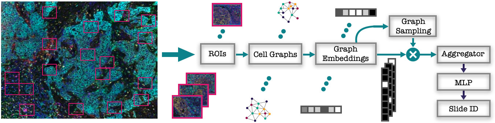

# Learning to Represent Whole Slide Images by Selecting Cell Graphs of Patches
Yinan Zhang, Beril Besbinar, Pascal Frossard

## Overview
This code is developed for the paper "Learning to Represent Whole Slide Images by Selecting Cell Graphs of Patches". In this paper, we propose an algorithm for classifying multi-graphs with automatic graph selection. Our framework introduces stochastic layers with discrete random variables into traditional graph neural networks and is end-to-end differentiable.



## Requirements
ipywidgets                7.5.1  
matplotlib                3.1.3  
networkx                  2.4  
numpy                     1.18.1  
pandas                    1.0.1  
pytorch                   1.4.0   
scikit-learn              0.22.2  
scipy                     1.4.1  
seaborn                   0.10.0  
tqdm                      4.43.0  
Especially, please install [Pytorch Geometric](https://pytorch-geometric.readthedocs.io/en/latest/notes/installation.html) as well.

## Usage

```
# 1. Create training / validation / test dataset using Data-Generation.ipynb using a fixed random seed 123 / 124 / 125 respectively.  

# 2. Pre-trained the graph embedding module and the classification layer using PatientClassifcation-pretrain.ipynb.

# 3. Assess pretraining results using Plot-results-pretrain.ipynb.

# 4. Load pre-trained parameters and jointly learn graph embedding and selection using PatientClassifcation-joint.ipynb. Note that you should choose a directory to save model parameters at different epochs.

# 5. Assess classifcation and selection performance using Plot-results-joint.ipynb.
```

## License
This project is licensed under the MIT License.

